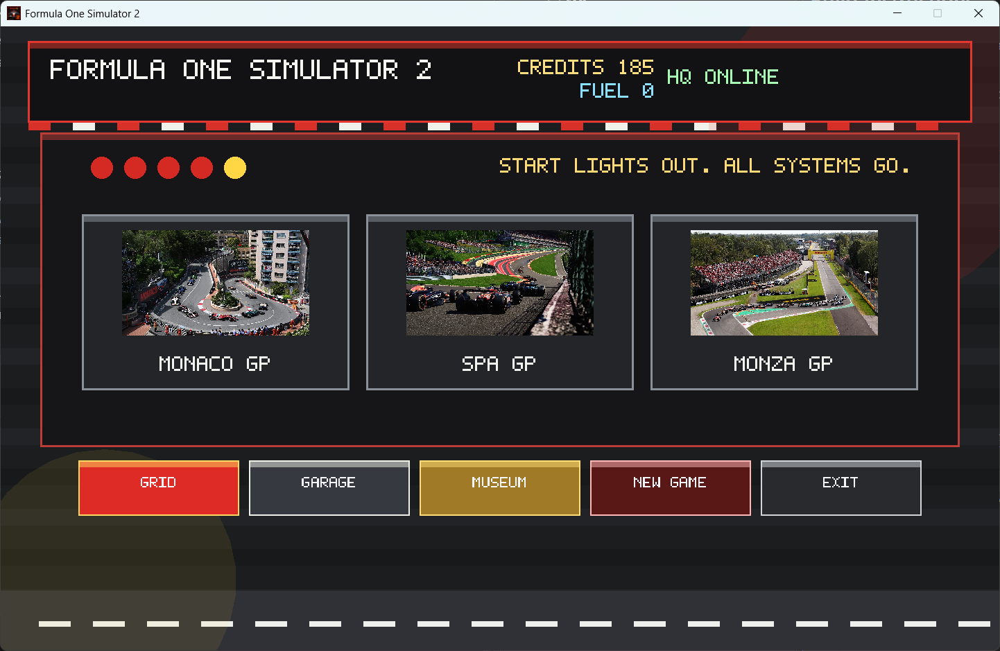
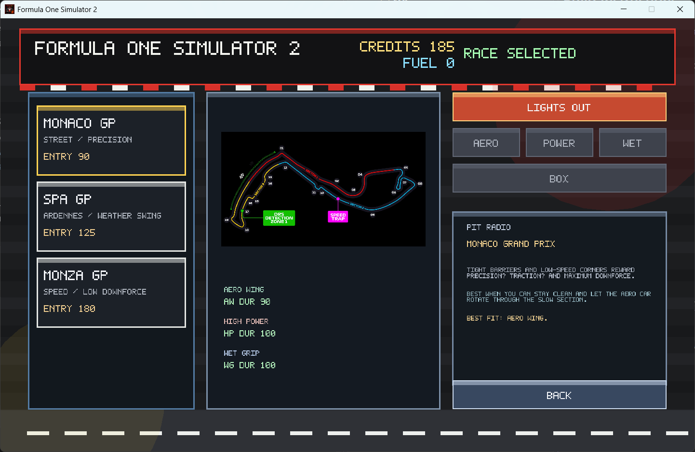
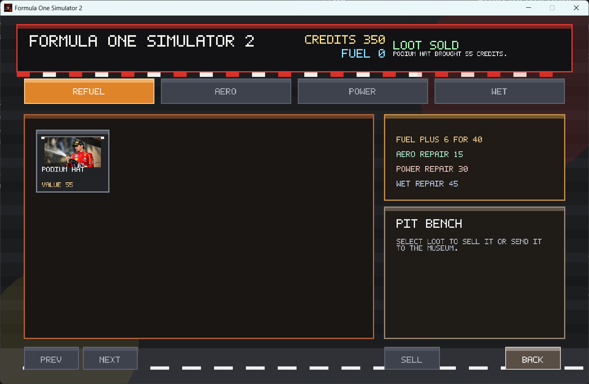
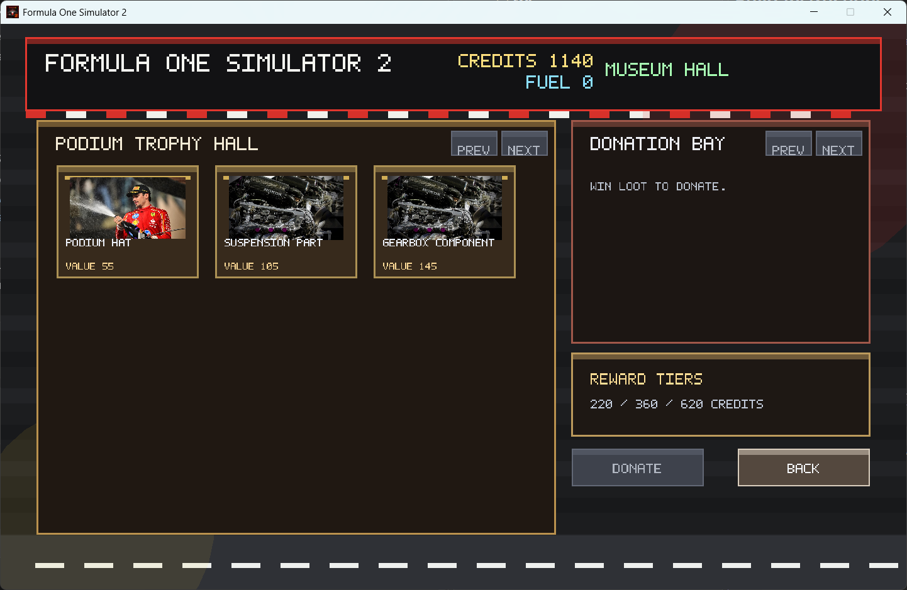

# ITMO.GameDev / C++ Programming / Practice 04 - F1 Simulator 2

## Project Description

This project is a C++ desktop game built with SFML where the player manages an F1 team through a graphical interface, enters Grand Prix events, upgrades garage mods, collects race loot, and expands a museum collection.

The application supports the following operations:
1. **Enter Grand Prix events**: Choose between Monaco, Spa, and Monza, each with its own entry fee, track conditions, and risk profile.
2. **Manage resources**: Track money and fuel, pay race entry costs, and buy new fuel packs to keep the season running.
3. **Use and repair garage mods**: Improve race outcomes with Aero Wing, High Power, and Wet Grip upgrades that wear down over time and can break.
4. **Collect and sell loot**: Earn Formula One themed collectibles and car parts from races, then sell them from the garage inventory for credits.
5. **Build a museum collection**: Donate loot items to the museum and unlock milestone cash rewards for growing the collection.
6. **Save progress**: Store player progress in the project-root `savegame.json` so the game can be continued later.

## Screenshots

### Main Menu


### Race Hub


### Garage


### Museum


## Build Instructions

1. Ensure CMake 3.25+, Ninja, and a C++17-compatible compiler are installed.
2. Make sure the required third-party packages are available in `external/` or through your `VCPKG_INSTALLED_DIR`.
3. Navigate to the project root directory.
4. Configure the project with one of the provided presets:
   ```bash
   cmake --preset windows-debug
   ```
   or
   ```bash
   cmake --preset windows-release
   ```
5. Build the project:
   ```bash
   cmake --build --preset windows-debug
   ```
   or
   ```bash
   cmake --build --preset windows-release
   ```
6. Run the executable from the generated build directory:
   ```bash
   .\out\build\x64-Debug\Formula_One_Simulator_2.exe
   ```

## Dependencies

This project uses the following third-party libraries:

- [SFML](https://www.sfml-dev.org/) - A multimedia library used for graphics, windowing, and system integration.
- [nlohmann/json](https://github.com/nlohmann/json) - A modern C++ JSON library (MIT License).